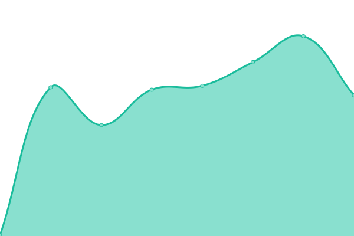
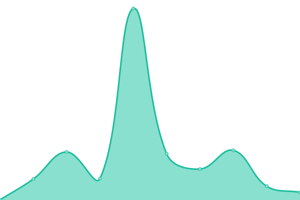
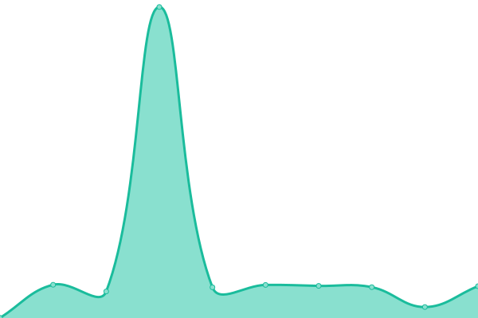
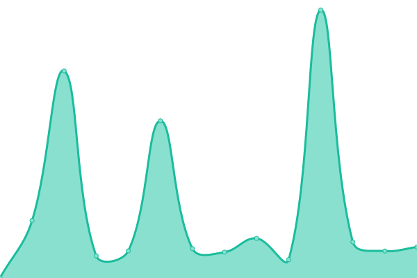
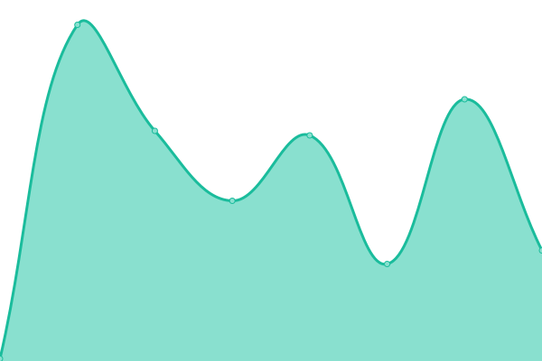
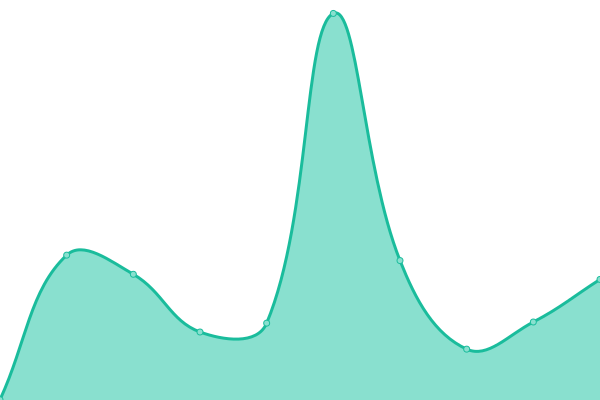
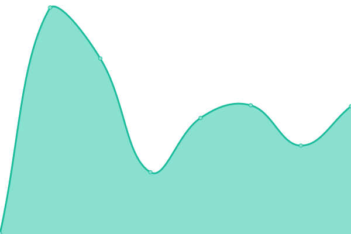
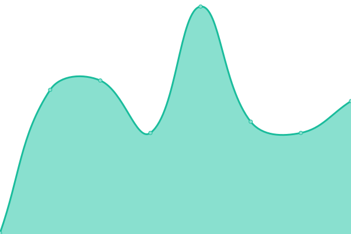

# [📈 Live Status](https://shaowenchen.github.io/upptime): <!--live status--> **🟧 Partial outage**

This repository contains the open-source uptime monitor and status page for [Shaowen Chen](https://www.chenshaowen.com/), powered by [Upptime](https://github.com/upptime/upptime).

With [Upptime](https://upptime.js.org), you can get your own unlimited and free uptime monitor and status page, powered entirely by a GitHub repository. We use [Issues](https://github.com/shaowenchen/upptime/issues) as incident reports, [Actions](https://github.com/shaowenchen/upptime/actions) as uptime monitors, and [Pages](https://shaowenchen.github.io/upptime) for the status page.

<!--start: status pages-->
<!-- This summary is generated by Upptime (https://github.com/upptime/upptime) -->
<!-- Do not edit this manually, your changes will be overwritten -->
<!-- prettier-ignore -->
| URL | Status | History | Response Time | Uptime |
| --- | ------ | ------- | ------------- | ------ |
|  [www.chenshaowen.com](https://www.chenshaowen.com) | 🟩 Up | [www-chenshaowen-com.yml](https://github.com/shaowenchen/upptime/commits/HEAD/history/www-chenshaowen-com.yml) | 

 269ms
     
 | 

<a href="https://upptime.chenshaowen.com/history/www-chenshaowen-com">100.00%</a>
    

|  account | 🟩 Up | [account.yml](https://github.com/shaowenchen/upptime/commits/HEAD/history/account.yml) | 

 223ms
     
 | 

<a href="https://upptime.chenshaowen.com/history/account">100.00%</a>
    

|  accountapi | 🟨 Degraded | [accountapi.yml](https://github.com/shaowenchen/upptime/commits/HEAD/history/accountapi.yml) | 

 314ms
     
 | 

<a href="https://upptime.chenshaowen.com/history/accountapi">0.00%</a>
    

|  payment | 🟩 Up | [payment.yml](https://github.com/shaowenchen/upptime/commits/HEAD/history/payment.yml) | 

 202ms
     
 | 

<a href="https://upptime.chenshaowen.com/history/payment">100.00%</a>
    

|  paymentapi | 🟥 Down | [paymentapi.yml](https://github.com/shaowenchen/upptime/commits/HEAD/history/paymentapi.yml) | 

 271ms
     
 | 

<a href="https://upptime.chenshaowen.com/history/paymentapi">0.00%</a>
    

|  upload | 🟩 Up | [upload.yml](https://github.com/shaowenchen/upptime/commits/HEAD/history/upload.yml) | 

 114ms
     
 | 

<a href="https://upptime.chenshaowen.com/history/upload">100.00%</a>
    

|  uploadapi | 🟩 Up | [uploadapi.yml](https://github.com/shaowenchen/upptime/commits/HEAD/history/uploadapi.yml) | 

 265ms
     
 | 

<a href="https://upptime.chenshaowen.com/history/uploadapi">100.00%</a>
    

|  llmapi | 🟩 Up | [llmapi.yml](https://github.com/shaowenchen/upptime/commits/HEAD/history/llmapi.yml) | 

 281ms
     
 | 

<a href="https://upptime.chenshaowen.com/history/llmapi">100.00%</a>
    

|  ghproxy | 🟩 Up | [ghproxy.yml](https://github.com/shaowenchen/upptime/commits/HEAD/history/ghproxy.yml) | 

 134ms
     
 | 

<a href="https://upptime.chenshaowen.com/history/ghproxy">100.00%</a>
    

<!--end: status pages-->

[**Visit our status website →**](https://shaowenchen.github.io/upptime)

## 📄 License

- Powered by: [Upptime](https://github.com/upptime/upptime)
- Code: [MIT](./LICENSE) © [Shaowen Chen](https://www.chenshaowen.com/)
- Data in the `./history` directory: [Open Database License](https://opendatacommons.org/licenses/odbl/1-0/)
